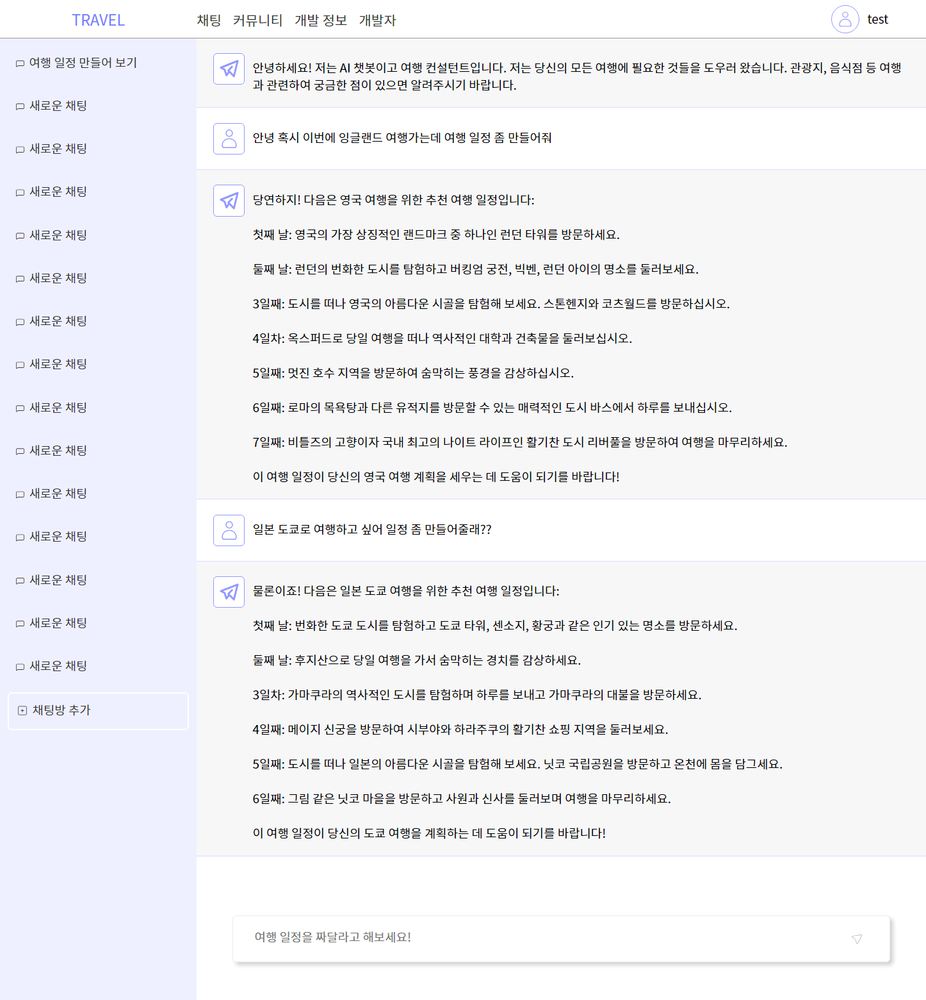
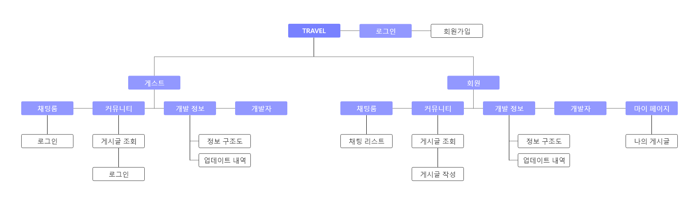
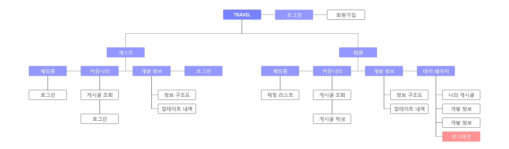

# travel-chatGPT-app
chat-GPT를 이용해 여행 일정 계획을 도와주는 애플리케이션 프로젝트<br/><br/>
게스트로 입장해도 채팅 기능과 커뮤니티의 내용을 확인 가능하게 작업했습니다.<br/><br/>
회원의 경우 채팅방을 여러개 만들 수 있으며 커뮤니티에 글을 작성할 수 있습니다.

<br/>
<br/>

## 개발 기술


<br />

## TRAVEL URL
✅ https://port-0-travelapp2023-6g2llf6xddzr.sel3.cloudtype.app/guest ✅


<br />

## Web 정보 구조도


<br />

## Moblie 정보 구조도


<br />

## 주요 기능 시퀀스 다이어그램


<br /><br /><br /><br />


<!-- ```javascript
    $(".btn_box .prev").on("click",function(){
        if(ww<padSize) return false;//태블릿 사이즈 끄기

        //오른쪽
        leftmove--;
        $(".brand_visual_list ul").stop().animate({"left":ul_basic-(-liww*leftmove)+"%"},300);

        if(leftmove == -8){
            leftmove = 0;
            $(".brand_visual_list ul").stop().css({"left":ul_basic+"%"});
        }

    });
``` -->
